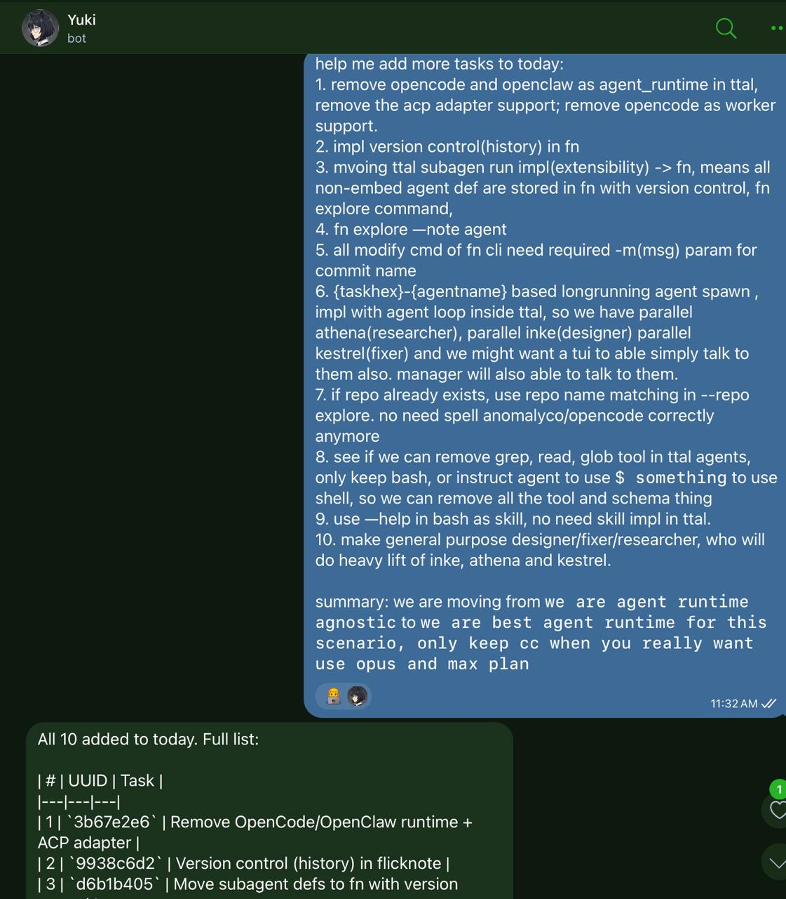
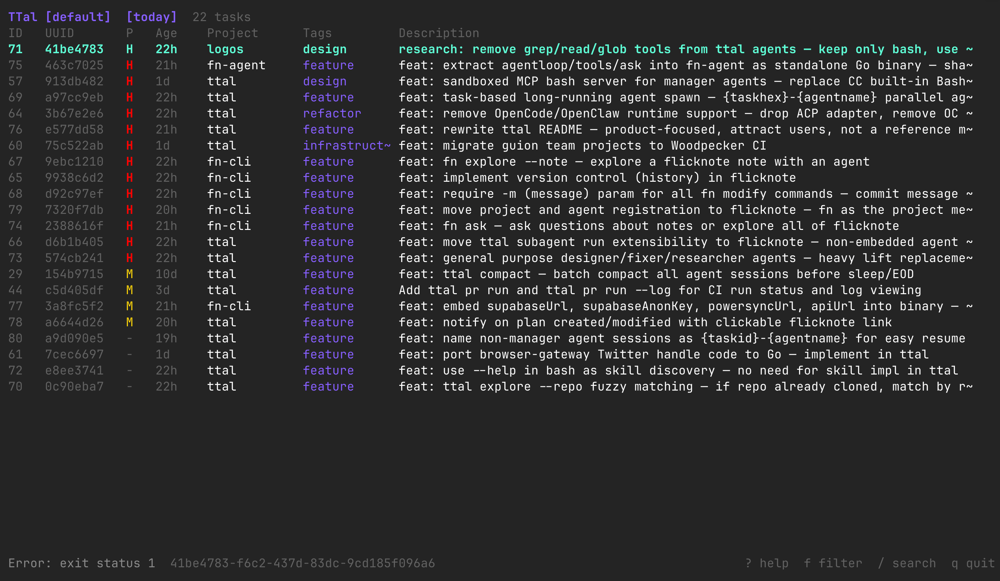
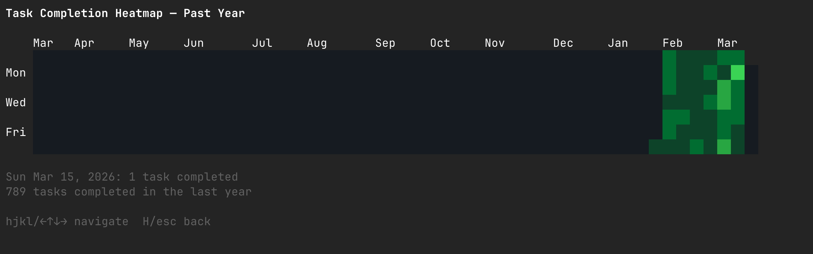
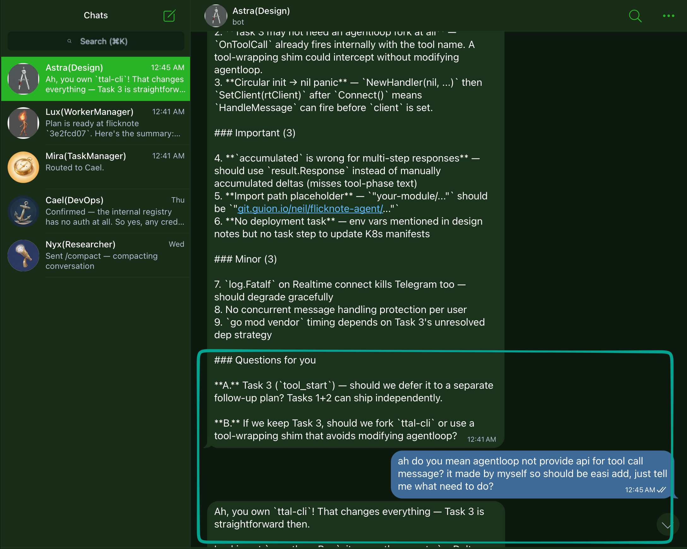

# TTal

Hi, I'm TTal — yes, a snail. Slow to break things, fast to ship them.

I carry my whole house in one binary — no cloud, no containers, no dependencies sprawl. Drop me in your terminal and I'll route tasks to the right agent, spawn workers in parallel, and leave a trail of merged PRs behind me.

**Agent ops CLI. One binary. Your terminal is the factory floor.**

## What it does

TTal turns your terminal into an agent assembly line. You describe what needs to happen, TTal handles the rest:

- **Route tasks** to the right agent — researcher investigates, designer plans, worker implements
- **Spawn workers** in isolated git worktrees — parallel execution, zero conflicts
- **Ship PRs** with automated review — 6 review agents, squash-merge from your phone
- **Talk to your agents** from Telegram — they talk back

```
task created → research → design → worker spawns → PR opens → review → merge → cleanup
```

All automatic. All in your terminal.




## See it work

```bash
# Create a task
ttal task add --project myapp "Add JWT authentication to the API"

# Route to researcher — she investigates options, writes findings
ttal task route abc12345 --to athena

# Route to designer — he reads research, writes the implementation plan
ttal task route abc12345 --to inke

# Execute — worker spawns in its own worktree, follows the plan, opens a PR
ttal task advance abc12345

# Meanwhile, you're on your phone
# Review agents post verdicts, worker triages feedback, you merge from Telegram
```

We built TTal with TTal. 356 PRs merged, 29k lines of Go in 33 days. Then we pointed it at flicknote-cli — 55 PRs merged in 15 days, Rust. Same pipeline, different repo, same velocity.



## Architecture

TTal is three things:

```
┌─────────────────────────────────────────┐
│  TTal         the orchestrator          │
│               routes tasks, spawns      │
│               workers, manages agents   │
├─────────────────────────────────────────┤
│  logos        the reasoning engine      │
│               bash-only agent loop      │
│               LLMs think in plain text  │
├─────────────────────────────────────────┤
│  temenos      the sacred boundary       │
│               seatbelt (macOS) / bwrap  │
│               (Linux) — YAGNI containers│
└─────────────────────────────────────────┘
```

**TTal** coordinates. **[logos](https://github.com/tta-lab/logos)** thinks. **[temenos](https://github.com/tta-lab/temenos)** isolates. Workers can't touch each other or the host.

Logos is a bash-only reasoning engine — no tool schemas, no JSON ceremony. Temenos is OS-native filesystem isolation — no containers needed. Three repos, one pipeline.

## Install

```bash
brew tap tta-lab/ttal
brew install ttal
```

Or from source:

```bash
go install github.com/tta-lab/ttal-cli@latest
```

## Quick start

Clone the repo and run `/setup` in Claude Code:

```bash
git clone https://github.com/tta-lab/ttal-cli.git && cd ttal-cli
# Open in Claude Code, then: /setup
```

The setup skill installs TTal, configures hooks, and walks you through Telegram integration. Five minutes to your first automated PR.

Or do it manually:

```bash
ttal doctor --fix      # install hooks
ttal daemon install    # start the communication hub
```

## The team

TTal agents aren't chatbots. They're specialists with clear roles:

| Agent | Role | What they do |
|-------|------|--------------|
| Yuki 🐱 | Orchestrator | Routes tasks, manages the pipeline |
| Athena 🦉 | Researcher | Investigates problems, writes findings |
| Inke 🐙 | Designer | Reads research, writes implementation plans |
| Workers | Coders | Spawn per-task, implement, open PRs, self-cleanup |

Each agent runs in its own tmux session. Workers get isolated git worktrees — they can't step on each other. The daemon handles all messaging: Telegram in, agent-to-agent routing, status updates out.



## How it connects

TTal is the execution layer of the [GuionAI ecosystem](https://github.com/tta-lab):

- **[FlickNote](https://flicknote.app/)** captures knowledge — voice memos, links, meeting notes
- **TTal** agents read and write to FlickNote via CLI — plans, research findings, even agent definitions live there

No MCP. CLI-first. Agents use the same tools you do.

## License

MIT
